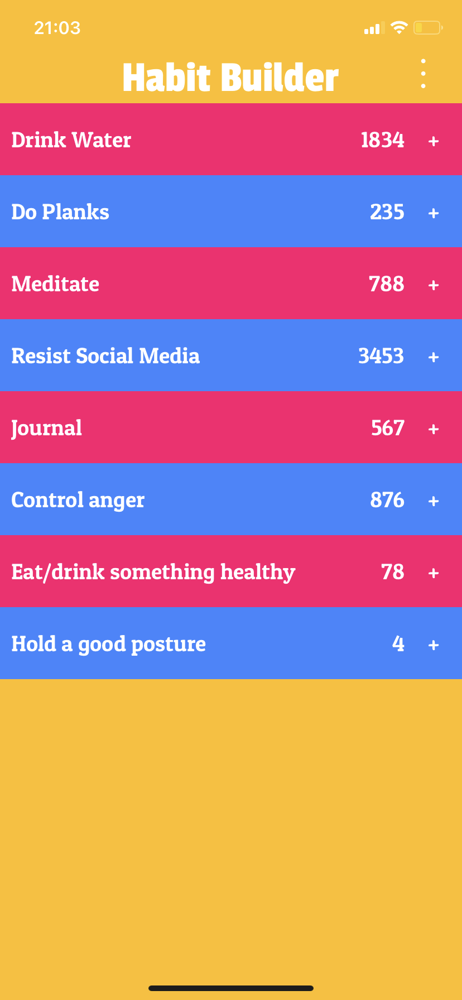
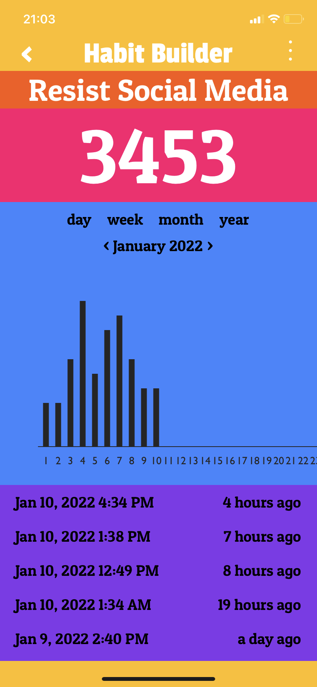
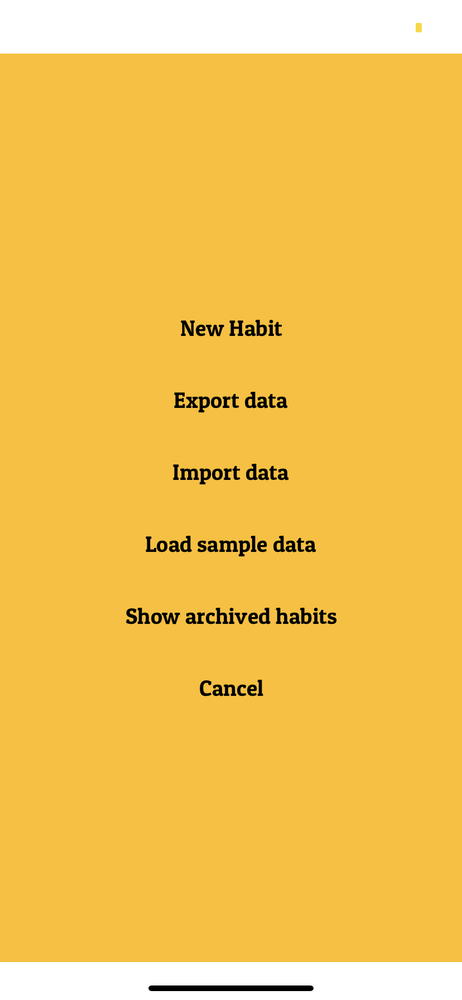

# Habit Builder

## About 

Instant gratification helps build a habit. Most habits don't give instant rewards but ticking something off gives a dopamine
hit which act as a proxy reward. It makes you feel good about what you do. This app has counters for each habit and shows your
progress over the weeks and days in charts, which is a really good motivation, in my opinion. 

## How to run

This can be run inside Expo Go app using <a href="exp://exp.host/@sivakar12/habit-builder">this URL</a>

Or you can close this repo, `npm install` and then use either of the following 
- Run `npm start` and then point your device to the QR code which opens it in Expo Go, whihch may need to be installed
- If you have an iOS emulator, run `npm run ios`
- If you have Android emulator, run `npm run android`

## Screenshots

  

## Todos

- [ ] Use SQLite database
- [ ] Swipe from left to go back
- [x] Rename habit feature
- [ ] Add linter for code
- [ ] Add axes to the chart